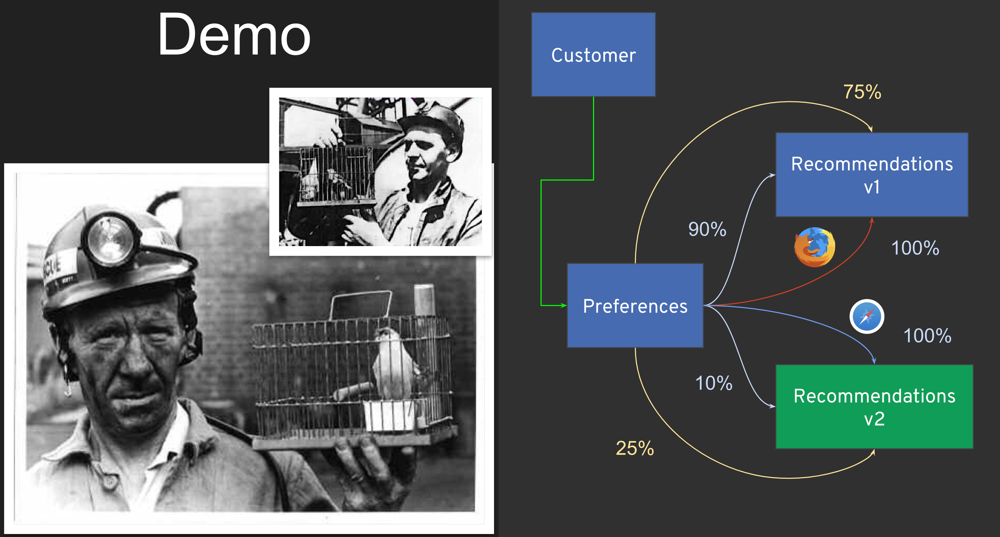

= Sail into Cloud
// Settings:
:idprefix:
:idseparator: -
ifndef::env-github[]
:icons: font
endif::[]
ifdef::env-github,env-browser[]
:toc: preamble
:toclevels: 1
endif::[]
ifdef::env-github[]
:status:
:outfilesuffix: .adoc
:!toc-title:
:caution-caption: :fire:
:important-caption: :exclamation:
:note-caption: :paperclip:
:tip-caption: :bulb:
:warning-caption: :warning:
endif::[]

// URIs:
ifdef::env-github[]
:uri-repo-file-prefix: link:
:uri-repo-tree-prefix: link:
endif::[]

[TIP]
====
If you are in a hurry and want to get hands-on with Istio insanely fast, just go to http://learn.openshift.com/servicemesh[http://learn.openshift.com/servicemesh] and start instantly
====

https://slidr.io/kameshsampath/sail-smoothly-in-the-cloud-an-introduction-to-istio#1[Download Slides]

[IMPORTANT]
====
This repo is used for easier explanation during the sessions. For detailed and up to date multi hour tutorial check https://bit.ly/istio-tutorial[istio tutorial].
====